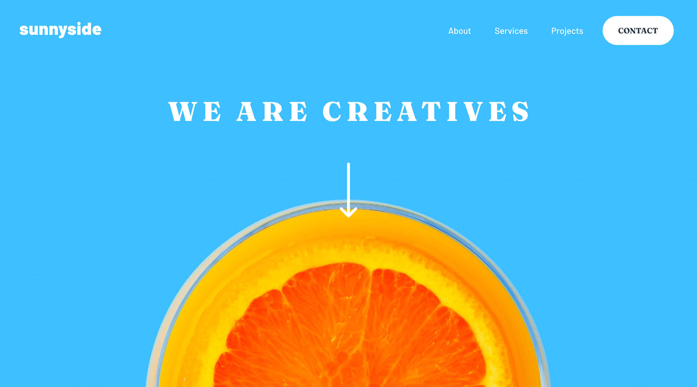

# Frontend Mentor - Sunnyside agency landing page solution

This is a solution to the [Sunnyside agency landing page challenge on Frontend Mentor](https://www.frontendmentor.io/challenges/sunnyside-agency-landing-page-7yVs3B6ef). Frontend Mentor challenges help you improve your coding skills by building realistic projects.

## Table of contents

- [Overview](#overview)
  - [The challenge](#the-challenge)
  - [Screenshot](#screenshot)
  - [Links](#links)
- [My process](#my-process)
  - [Built with](#built-with)
  - [What I learned](#what-i-learned)
  - [Useful resources](#useful-resources)
- [Author](#author)
- [Acknowledgments](#acknowledgments)

## Overview

### The challenge

Users should be able to:

- View the optimal layout for the site depending on their device's screen size
- See hover states for all interactive elements on the page

### Screenshot



### Links

- [Solution URL](https://www.frontendmentor.io/challenges/sunnyside-agency-landing-page-7yVs3B6ef/hub/sunnyside-agency-landing-page-bVtV41b2N)
- [Live Site URL](https://mystifying-kilby-db09c2.netlify.app/)

## My process

### Built with

- Semantic HTML5 markup
- CSS custom properties
- Flexbox
- CSS Grid
- Mobile-first workflow
- [Astro](https://docs.astro.build/en/getting-started/) - static site builder

### What I learned

- Text on top of images with grid (see Projects.astro)

```scss
.right_panel {
  display: grid;

  picture,
  img {
    grid-area: 1/1;
    width: 100%;
    object-fit: cover;
  }
  .text {
    grid-area: 1/1;
    position: relative;
    text-align: center;
  }
}
```

- Using box-shadow to make a underline (see Features.astro)

```scss
.clr-primary {
  box-shadow: inset 0 -0.4rem hsl(var(--primary) / 0.5);
  &:hover {
    box-shadow: inset 0 -1.2rem hsl(var(--primary) / 1);
  }
}
```

- coloring svgs with css (see Footer.astro)

```scss
.socials {
  gap: 1.75rem;
  padding-top: 5.5rem;
  a svg path {
    transition: all 0.3s ease;
  }
  a:hover,
  a:focus {
    svg path {
      fill: hsl(var(--white));
    }
  }
}
```

### Useful resources

- [Solution of Markteekman](https://github.com/markteekman/sunnyside-agency-landing-page) - I was inspired from some of his stuffs in his solutions. Also thanks to this solution I wanted to do this challenge by myself. Saddly it is not as nice as this solution. I will keep going and improve 💪.

## Author

- [52 Weeks 52 Websites](https://www.minhkhangtran.com/)
- [Frontend Mentor Profile](https://www.frontendmentor.io/profile/MinhKhangTran)
- [Twitter](https://twitter.com/devLifting_)
- [Github](https://github.com/MinhKhangTran)

## Acknowledgments

- [Solution of Markteekman](https://github.com/markteekman/sunnyside-agency-landing-page)
